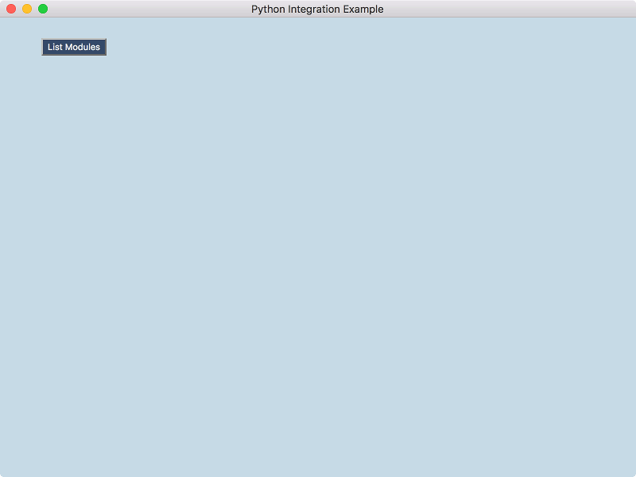

How to Build an Electron GUI for a Python Module
------------------------------------------------

This project demonstrates how to display the output of a Python module in Electron. The demonstration code performs the following features across platforms [1](#f1):

- Detect if Python 3+ is installed
- Detect if application specific Python module dependencies are installed
- List installed, top-level, Python modules in an Electron BrowserWindow

September 2020 Update
---------------------
- Revised the Python code to version 3.8 best practices.
- Revised the Electron code to version 10.1
- Tested the project on Mac OS 10.15, Ubuntu 20.04, and Windows 10.

Quick Code Tour
---------------
- The code entry point is in **package.json** under the key "main". The value is "main.js"
- **main.js** creates a BrowserWindow and loads **index.html**.
- **index.html** displays a button to click to get a list of top-level Python modules and loads **renderer.js**.
- **renderer.js** loads jQuery and provides an event handler for the button. It also checks for Python 3+ and dependencies. On Win32 it also unpacks it's Python modules from the Electron Asar and places them in app.getPath('userData'). See controller.initPythonWin32() for more.

Animated Screenshot
-------------------
 

<b id="f1">1</b> Tested on Mac OS 10.15, Ubuntu 20.04, and Windows 10[↩](#a1)
